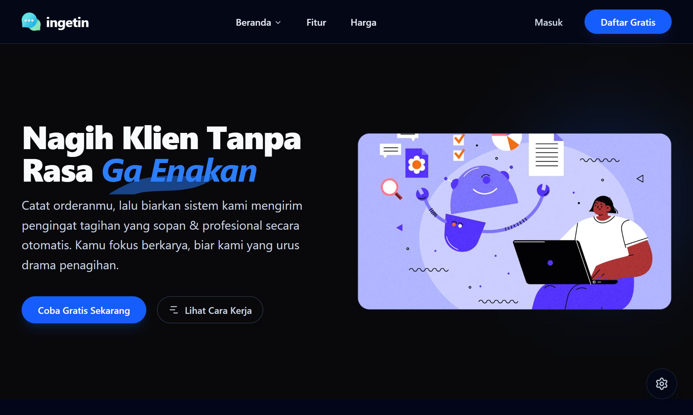

<div align="center">

  <a href="https://ingetin.vercel.app/">
    
  </a>

  # Ingetin 🚀

  **Nagih Klien Tanpa Rasa 'Ga Enakan'**
  
  *Get Paid Without the Awkwardness*

  <div style="display: flex; justify-content: center; gap: 10px; margin-top: 10px;">
    <a href="https://github.com/Ghifariezra/ingetin">
      
    </a>
    <a href="https://ingetin.vercel.app">
      
    </a>
    
  </div>

</div>

<br />

## 📖 About

**Ingetin** adalah platform SaaS yang dirancang khusus untuk Freelancer dan UMKM. Kami memahami bahwa masalah terbesar dalam freelancing bukan hanya mengerjakan proyek, tapi juga menagih pembayarannya.

Masalah utama yang kami selesaikan adalah **Social Friction**: rasa sungkan, takut dianggap galak, atau sekadar lupa menagih. Dengan Ingetin, pengguna dapat mencatat order, memantau cashflow, dan membiarkan sistem mengirimkan email pengingat tagihan (*Invoice Reminders*) secara otomatis.

> [!IMPORTANT]
> **🚀 Current Status: v0.5.0 (Authentication & Security)**
> Update ini menghadirkan sistem autentikasi penuh yang aman dan stabil.
> * ✅ **Secure Auth:** Login & Register menggunakan **Supabase Auth**.
> * ✅ **Social Login:** Dukungan masuk menggunakan **Google Account**.
> * ✅ **Bot Protection:** Integrasi **Cloudflare Turnstile (Captcha)** pada form registrasi.
> * ✅ **Robust Routing:** Perbaikan middleware dan penanganan error 404 yang lebih baik.

## ✨ Key Features

| Feature | Status | Description |
| :--- | :---: | :--- |
| **Authentication System** | ✅ | Login/Register via Email & Google OAuth (Supabase). |
| **Bot Protection** | ✅ | Anti-spam registration menggunakan Cloudflare Turnstile. |
| **Multi-language (i18n)** | ✅ | Dukungan penuh Bahasa Indonesia & English via `next-intl`. |
| **Legal Compliance** | ✅ | Halaman Privacy Policy, Terms, dan Cookies terintegrasi. |
| **Documentation Center** | ✅ | Halaman FAQ interaktif dengan Accordion UI. |
| **Automated Reminders** | 🏗️ | Mengirim email pengingat otomatis (Upcoming Feature). |

## 🛠️ Tech Stack

Project ini dibangun di atas ekosistem modern untuk menjamin performa, keamanan, dan skalabilitas.

**Core & Framework:**
<br />


**Backend & Auth:**
<br />


**Security & Validation:**
<br />


**Styling & UI:**
<br />


## ⚙️ Environment Variables

Untuk menjalankan project ini di local, buat file `.env.local` dan isi variabel berikut:

```bash
# Supabase Configuration
NEXT_PUBLIC_SUPABASE_URL=your_supabase_url
NEXT_PUBLIC_SUPABASE_ANON_KEY=your_supabase_anon_key

# Cloudflare Turnstile (Captcha)
NEXT_PUBLIC_TURNSTILE_SITE_KEY=your_site_key
TURNSTILE_SECRET_KEY=your_secret_key

# App Configuration
NEXT_PUBLIC_BASE_URL=http://localhost:3000
```

## 📂 Project Structure
Struktur folder terbaru v0.5.0:
```bash
ingetin
├── src/
│   ├── app/                # Next.js App Router
│   │   ├── api/            # API Routes (Auth Callback)
│   │   ├── [locale]/       # Localized Routes
│   │   │   ├── auth/       # Login & Register Pages
│   │   │   ├── (legal)/    # Privacy, Terms, Cookies
│   │   │   └── ...
│   │   └── not-found.tsx   # Global 404 Handler
│   ├── components/
│   │   ├── providers/      # AuthProvider, ThemeProvider
│   │   └── ui/             # Shadcn Components
│   ├── lib/
│   │   └── supabase/       # Supabase Client & Server Utilities
│   ├── middleware.ts       # Auth & i18n Middleware
│   └── ...
└── public/
```

## 🤝 Contributing

Kontribusi selalu diterima! Jika kamu ingin membantu mengembangkan Ingetin:

1.  Fork repository ini.
2.  Buat branch fitur baru (`git checkout -b fitur-keren`).
3.  Commit perubahanmu (`git commit -m 'Menambahkan fitur keren'`).
4.  Push ke branch (`git push origin fitur-keren`).
5.  Buat Pull Request.

## 📄 License

Project ini dilisensikan di bawah [MIT License](LICENSE).

---

Built with ❤️ by **[Ezdev](https://www.ezdev.xyz/)**.